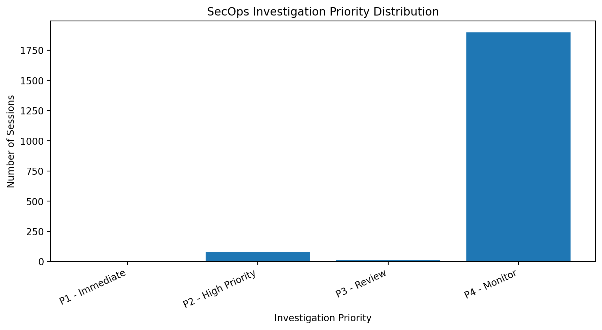
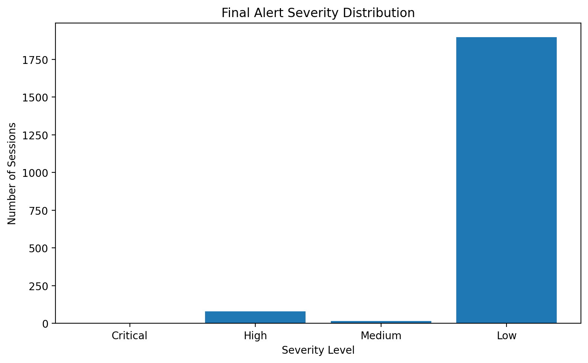
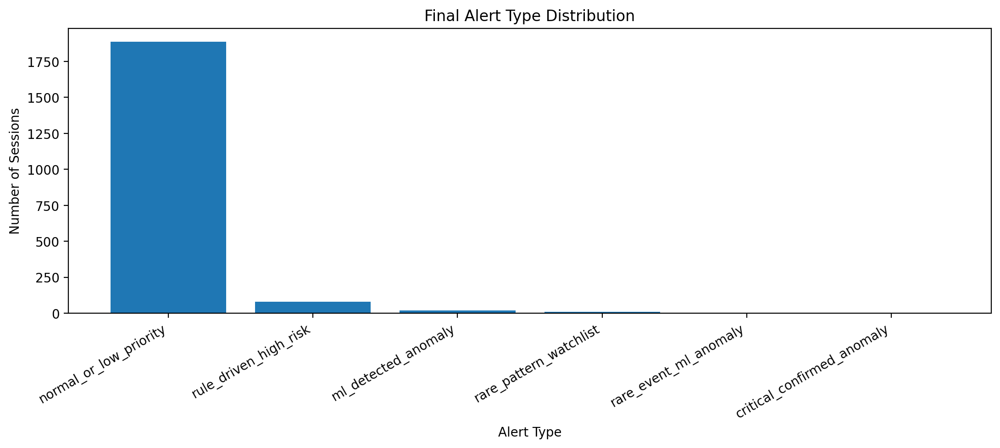
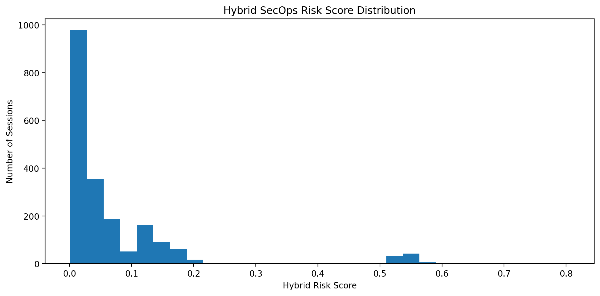
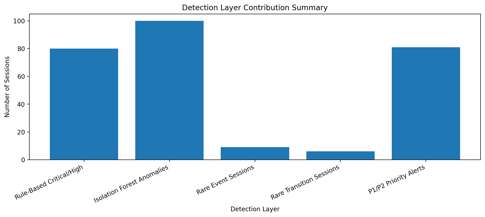
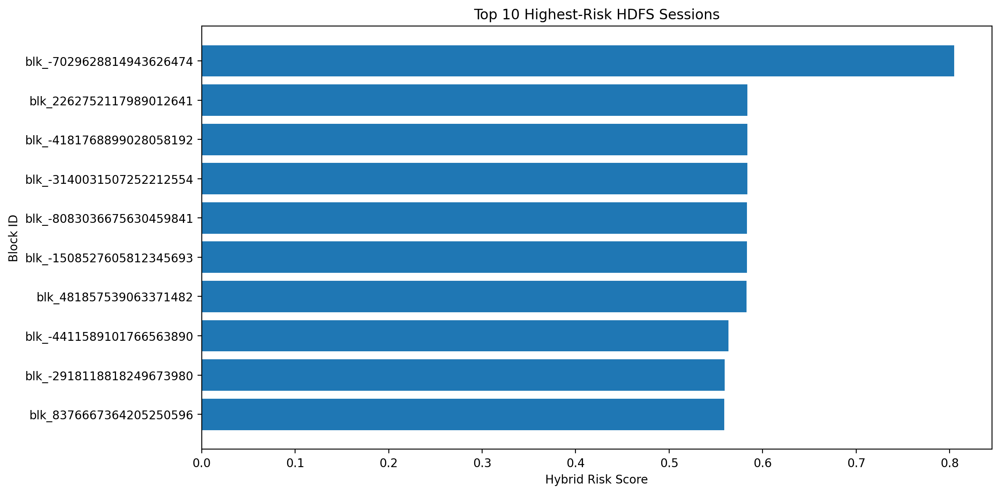

# SecOps Log Anomaly Triage using HDFS Logs

This repository contains a notebook-based SecOps-style log anomaly triage project using public HDFS structured logs from LogHub.

The project goes beyond basic anomaly detection. It combines rule-based risk scoring, Isolation Forest anomaly detection, rare Event ID analysis, event-transition rarity analysis, hybrid risk scoring, severity labeling, and analyst-style alert explanations.

---

## Project Objective

Security teams handle large volumes of system, application, and infrastructure logs. A useful monitoring system should not only detect unusual behavior, but also explain:

1. Which session is suspicious?
2. Why is it suspicious?
3. How severe is it?
4. What should the analyst do next?

This project simulates a lightweight SecOps alert triage workflow using HDFS structured logs.

---

## Dataset

This project uses the public **LogHub HDFS 2k structured log dataset**.

Dataset source:

```text
https://github.com/logpai/loghub/tree/master/HDFS
```

Main dataset files used:

```text
https://raw.githubusercontent.com/logpai/loghub/master/HDFS/HDFS_2k.log_structured.csv
https://raw.githubusercontent.com/logpai/loghub/master/HDFS/HDFS_2k.log_templates.csv
```

The structured log dataset contains fields such as:

| Column | Meaning |
|---|---|
| LineId | Log line number |
| Date | Log date |
| Time | Log time |
| Pid | Process ID |
| Level | Log level such as INFO or WARN |
| Component | HDFS system component |
| Content | Original log message content |
| EventId | Parsed event identifier |
| EventTemplate | Parsed event template |

The HDFS 2k sample does not include official anomaly labels. Therefore, this project is presented as an **unsupervised anomaly triage system**, not a supervised attack classification system.

---

## Main Contribution

The main contribution of this project is a **hybrid SecOps alert triage engine**.

Instead of only running Isolation Forest, the system combines multiple detection signals:

- Rule-based risk scoring
- Isolation Forest anomaly detection
- Rare Event ID analysis
- Event-transition rarity analysis
- E3 exception-ending behavior
- Hybrid risk scoring
- Severity labeling
- Human-readable alert explanations
- Recommended analyst actions

This makes the output more useful for security monitoring and investigation.

---

## System Architecture

```text
HDFS Structured Logs
        ↓
Block/Session Extraction
        ↓
Session-Level Feature Engineering
        ↓
Rule-Based Risk Scoring
        ↓
Isolation Forest Anomaly Detection
        ↓
Rare Event ID Analysis
        ↓
Event Transition Rarity Analysis
        ↓
Hybrid SecOps Risk Score
        ↓
Severity + Priority Assignment
        ↓
Human-Readable Alert Explanation
        ↓
Recommended Analyst Action
```

---

## Notebook

Main notebook:

```text
Security_Log_Anomaly_Triage.ipynb
```

The notebook includes the complete workflow:

1. Loading public HDFS structured logs
2. Exploratory log analysis
3. Block/session extraction
4. Session-level feature engineering
5. Rule-based SecOps risk scoring
6. Isolation Forest anomaly detection
7. Rare Event ID analysis
8. Event-transition rarity analysis
9. Hybrid risk scoring
10. Alert severity and priority assignment
11. Human-readable explanation generation
12. Final result visualization

---

## Features Engineered

For each HDFS block/session, the system extracts:

| Feature Type | Examples |
|---|---|
| Session features | log count, line span, first event, last event |
| Event features | Event ID frequency, unique event count |
| Component features | component frequency, unique component count |
| Log level features | INFO count, WARN count |
| Keyword features | exception, error, failed, delete, transfer |
| Rare event features | rare Event ID count, max event rarity |
| Transition features | event transitions, rare transition count |
| ML anomaly features | Isolation Forest anomaly score |
| Risk features | rule risk score, hybrid risk score |

---

## Detection Layers

### 1. Rule-Based Risk Scoring

The rule-based layer flags known risk indicators such as:

- WARN-level logs
- Exception/error/failure keywords
- Event ID `E3`, associated with exception while serving an HDFS block
- Delete/remove-related activity
- Multi-event sessions
- Multi-component sessions

### 2. Isolation Forest Anomaly Detection

Isolation Forest is used to detect statistically unusual sessions based on session-level features.

### 3. Rare Event ID Analysis

Rare Event IDs are identified using frequency-based rarity scoring.

### 4. Event Transition Rarity Analysis

The system checks whether event sequences contain rare transitions such as:

```text
E11 -> E3
```

This adds sequence-awareness to the detection pipeline.

### 5. Hybrid SecOps Risk Score

The final hybrid score combines:

- Rule-based risk
- ML anomaly risk
- Rare event score
- Rare transition score
- Exception-ending behavior

---

## Results Summary

The system analyzed **1994 HDFS block/session traces**.

| Output Metric | Value |
|---|---:|
| Total Sessions Analyzed | 1994 |
| P1 Immediate Alerts | 1 |
| P2 High Priority Alerts | 80 |
| P3 Review Alerts | 16 |
| P4 Monitor Alerts | 1897 |
| Isolation Forest Anomalies | 100 |
| Rare Event Sessions | 9 |
| Rare Transition Sessions | 6 |
| Highest Hybrid Risk Score | 0.8049 |
| Top Alert Event Sequence | E11 -> E3 |

The top alert was:

```text
blk_-7029628814943626474
```

with event sequence:

```text
E11 -> E3
```

This alert was classified as:

```text
Critical
```

and assigned:

```text
P1 - Immediate
```

---

## Top Alert Example

| Field | Value |
|---|---|
| Block ID | `blk_-7029628814943626474` |
| Priority | P1 - Immediate |
| Severity | Critical |
| Alert Type | critical_confirmed_anomaly |
| Hybrid Risk Score | 0.8049 |
| Event Sequence | `E11 -> E3` |

### Explanation

The top alert was flagged because it had a high rule-based risk score, contained WARN-level log activity, included exception/error/failure-related text, contained Event ID `E3`, was detected as anomalous by Isolation Forest, contained a rare event transition, and started with a non-exception event before ending with an E3 exception event.

### Recommended Analyst Action

Immediate investigation is recommended. The analyst should review the full block trace, related DataNode activity, exception context, and surrounding logs before and after this session.

---

## Visual Results

### Investigation Priority Distribution



### Final Alert Severity Distribution



### Final Alert Type Distribution



### Hybrid SecOps Risk Score Distribution



### Detection Layer Contribution Summary



### Top 10 Highest-Risk Sessions



---

## Repository Structure

```text
secops-log-anomaly-triage-hdfs/
│
├── README.md
├── requirements.txt
├── Security_Log_Anomaly_Triage.ipynb
│
├── data/
│   ├── hdfs_2k_structured_logs.csv
│   ├── hdfs_2k_log_templates.csv
│   ├── hdfs_block_session_traces.csv
│   └── hdfs_session_level_features.csv
│
├── results/
│   ├── final_secops_alert_triage_table.csv
│   ├── top_25_secops_alerts.csv
│   ├── top_10_alert_triage_report.md
│   ├── project_metrics_summary.csv
│   ├── final_triage_summary.json
│   │
│   └── Figures/
│       ├── investigation_priority_distribution.png
│       ├── final_alert_severity_distribution.png
│       ├── final_alert_type_distribution.png
│       ├── hybrid_secops_risk_score_distribution.png
│       ├── detection_layer_contribution_summary.png
│       └── top_10_highest_risk_sessions.png
```

---

## How to Run

Clone the repository:

```bash
git clone https://github.com/duttosourav8/secops-log-anomaly-triage-hdfs.git
cd secops-log-anomaly-triage-hdfs
```

Install dependencies:

```bash
pip install -r requirements.txt
```

Open the notebook:

```bash
jupyter notebook Security_Log_Anomaly_Triage.ipynb
```

Or open the notebook directly in Google Colab.

---

## Tools and Technologies

- Python
- pandas
- NumPy
- scikit-learn
- Isolation Forest
- MinMaxScaler
- StandardScaler
- Matplotlib
- LogHub HDFS structured logs
- Jupyter Notebook / Google Colab

---

## Security Relevance

This project is relevant to:

- SecOps monitoring
- Log analysis
- Threat detection
- Alert triage
- Security event prioritization
- Anomaly detection
- Explainable security analytics

It demonstrates how machine learning and rule-based logic can be combined to support security analysts in identifying suspicious system behavior.

---

## Limitations

This project uses the HDFS 2k structured log sample, which does not contain official ground-truth anomaly labels.

Therefore:

- The project does not claim supervised classification accuracy.
- The system is designed as an unsupervised anomaly triage pipeline.
- Alert severity is based on hybrid scoring, not confirmed cyberattack labels.

Future improvements:

- Use a larger labeled HDFS anomaly dataset
- Add supervised classification when labels are available
- Add log sequence models such as LSTM or Transformer encoders
- Add support for other LogHub datasets such as BGL, OpenStack, Linux, and Hadoop logs
- Build a Streamlit dashboard for interactive alert exploration
- Add real-time log ingestion support

---

